# Microservice Architecture Diagram

## 1. High-Level System Architecture

```mermaid
graph TB
    subgraph "Client Layer"
        Mobile[📱 Mobile App]
        Web[🌐 Web App]
        Admin[⚙️ Admin Panel]
    end
    
    subgraph "Edge Layer"
        Gateway[🚪 API Gateway - YARP<br/>Port:  5000<br/>- JWT Auth<br/>- Rate Limiting<br/>- Routing]
    end
    
    subgraph "Application Layer - Microservices"
        UserService[👤 User Service<br/>Port: 5001<br/>- Auth/JWT<br/>- Users/Roles]
        PointService[📍 Point Service<br/>Port: 5002<br/>- Points<br/>- Subscriptions<br/>- Photos]
        EventService[📅 Event Service<br/>Port:  5003<br/>- Events<br/>- Event Types<br/>- Scheduler]
        WalletService[💰 Wallet Service<br/>Port: 5004<br/>- Wallets<br/>- Transactions<br/>- Donations]
        BadgeService[🏆 Badge Service<br/>Port: 5005<br/>- Badges<br/>- Achievements<br/>- Rewards]
        NotificationService[🔔 Notification Service<br/>Port: 5006<br/>- Push/Email/SMS<br/>- Outbox Pattern]
    end
    
    subgraph "Message Broker"
        RabbitMQ[🐰 RabbitMQ<br/>Port: 5672<br/>- Event Bus<br/>- MassTransit]
    end
    
    subgraph "Data Layer"
        PostgreSQL[(🐘 PostgreSQL<br/>Port: 5432<br/>- Main Database)]
        Redis[(⚡ Redis<br/>Port: 6379<br/>- Cache<br/>- Session)]
        S3[☁️ AWS S3<br/>- Photo Storage]
    end
    
    subgraph "Monitoring & Logging"
        Seq[📊 Seq<br/>Port: 5341<br/>- Centralized Logs]
        Prometheus[📈 Prometheus<br/>Port: 9090<br/>- Metrics]
        Grafana[📉 Grafana<br/>Port: 3000<br/>- Dashboards]
        Jaeger[🔍 Jaeger<br/>Port: 16686<br/>- Distributed Tracing]
    end
    
    Mobile --> Gateway
    Web --> Gateway
    Admin --> Gateway
    
    Gateway --> UserService
    Gateway --> PointService
    Gateway --> EventService
    Gateway --> WalletService
    Gateway --> BadgeService
    
    UserService --> PostgreSQL
    PointService --> PostgreSQL
    EventService --> PostgreSQL
    WalletService --> PostgreSQL
    BadgeService --> PostgreSQL
    NotificationService --> PostgreSQL
    
    UserService --> Redis
    PointService --> Redis
    EventService --> Redis
    
    PointService --> S3
    
    UserService -.->|Publish Events| RabbitMQ
    PointService -.->|Publish Events| RabbitMQ
    EventService -.->|Publish Events| RabbitMQ
    WalletService -.->|Publish Events| RabbitMQ
    BadgeService -.->|Publish Events| RabbitMQ
    
    RabbitMQ -.->|Consume Events| NotificationService
    RabbitMQ -.->|Consume Events| BadgeService
    RabbitMQ -.->|Consume Events| WalletService
    
    UserService --> Seq
    PointService --> Seq
    EventService --> Seq
    WalletService --> Seq
    BadgeService --> Seq
    NotificationService --> Seq
    
    UserService --> Prometheus
    PointService --> Prometheus
    EventService --> Prometheus
    WalletService --> Prometheus
    BadgeService --> Prometheus
    NotificationService --> Prometheus
    
    Prometheus --> Grafana
    
    UserService --> Jaeger
    PointService --> Jaeger
    EventService --> Jaeger
    WalletService --> Jaeger
    BadgeService --> Jaeger
    NotificationService --> Jaeger
    
    style Gateway fill:#ff6b6b,stroke:#c92a2a,color:#fff
    style RabbitMQ fill:#ff922b,stroke:#e67700,color:#fff
    style PostgreSQL fill:#4dabf7,stroke:#1971c2,color:#fff
    style Redis fill:#ff6b6b,stroke:#c92a2a,color:#fff
```



## 2. Event-Driven Flow Example:  User Creates Event

```mermaid
sequenceDiagram
    actor User as 👤 Mobile User
    participant Gateway as 🚪 API Gateway
    participant EventSvc as 📅 Event Service
    participant DB as 🐘 PostgreSQL
    participant RMQ as 🐰 RabbitMQ
    participant NotifSvc as 🔔 Notification Service
    participant BadgeSvc as 🏆 Badge Service
    participant OutboxDB as 📬 Outbox Table
    
    User->>Gateway: POST /api/events<br/>{point_id, event_type_id}
    Gateway->>Gateway: Validate JWT
    Gateway->>EventSvc: Forward Request
    
    EventSvc->>EventSvc:  Validate Business Rules
    EventSvc->>DB: BEGIN TRANSACTION
    EventSvc->>DB: INSERT INTO events
    EventSvc->>DB:  COMMIT
    
    EventSvc->>RMQ:  Publish "event. created"<br/>{event_id, point_id, user_id}
    EventSvc-->>Gateway: 201 Created
    Gateway-->>User: Success Response
    
    RMQ->>NotifSvc: Consume "event.created"
    NotifSvc->>DB: Get point subscribers
    NotifSvc->>OutboxDB: INSERT notifications<br/>(status:  pending)
    NotifSvc->>NotifSvc: Background Worker
    NotifSvc->>NotifSvc: Send Push Notifications
    NotifSvc->>OutboxDB: UPDATE status = 'sent'
    NotifSvc->>RMQ: ACK Message
    
    RMQ->>BadgeSvc: Consume "event.created"
    BadgeSvc->>DB: Count user's events
    BadgeSvc->>DB: Check badge requirements
    alt Badge Earned
        BadgeSvc->>DB: INSERT user_badges
        BadgeSvc->>RMQ: Publish "badge.earned"
        RMQ->>NotifSvc:  Consume "badge.earned"
        NotifSvc->>NotifSvc: Send Badge Notification
    end
    BadgeSvc->>RMQ: ACK Message
```



## 3. Donation Flow with Saga Pattern


## 4. Notification Service - Outbox Pattern


## 5. Service Communication Patterns


## 6. Database Schema Distribution


## 7. Deployment Architecture (Docker Compose - Development)


## 8. Resilience Patterns

```mermaid
graph TB
    subgraph "Client Request Flow with Resilience"
        Client[📱 Client]
        Gateway[🚪 API Gateway]
        
        subgraph "Event Service"
            Controller[Controller]
            Polly{Polly Policies}
            HttpClient[HTTP Client]
        end
        
        subgraph "User Service"
            UserAPI[User API]
        end
        
        Client -->|1. Request| Gateway
        Gateway -->|2. Forward| Controller
        Controller -->|3. Call User Service| Polly
        
        Polly -->|Timeout Policy<br/>10 seconds| TimeoutCheck{Timeout? }
        TimeoutCheck -->|No| Polly
        TimeoutCheck -->|Yes| TimeoutError[❌ Timeout Error]
        
        Polly -->|Retry Policy<br/>3 attempts<br/>Exponential Backoff| RetryCheck{Retry?}
        RetryCheck -->|Attempt| HttpClient
        RetryCheck -->|Max Attempts| RetryError[❌ Retry Failed]
        
        HttpClient -->|4. HTTP Request| CircuitBreaker{Circuit Breaker}
        CircuitBreaker -->|Closed| UserAPI
        CircuitBreaker -->|Open<br/>5 failures| CircuitError[❌ Circuit Open]
        
        UserAPI -->|5. Response| HttpClient
        HttpClient -->|6. Success| Controller
        Controller -->|7. Response| Gateway
        Gateway -->|8. Response| Client
        
        TimeoutError --> Fallback[🔄 Fallback Response]
        RetryError --> Fallback
        CircuitError --> Fallback
        Fallback --> Controller
    end
    
    style Polly fill:#ff922b,stroke:#e67700,color:#fff
    style CircuitBreaker fill:#ff6b6b,stroke:#c92a2a,color:#fff
    style Fallback fill:#51cf66,stroke:#2f9e44,color:#fff
```



## 9. Monitoring & Observability

```mermaid
graph TB
    subgraph "Application Layer"
        Services[All Microservices]
    end
    
    subgraph "Observability Stack"
        subgraph "Logging"
            Serilog[Serilog]
            Seq[Seq - Log Aggregation]
        end
        
        subgraph "Metrics"
            PromClient[Prometheus Client]
            Prometheus[Prometheus]
            Grafana[Grafana Dashboards]
        end
        
        subgraph "Tracing"
            OTel[OpenTelemetry]
            Jaeger[Jaeger]
        end
        
        subgraph "Health Checks"
            HealthEndpoint["health endpoint"]
            HealthUI[Health Checks UI]
        end
    end
    
    Services -->|Structured Logs| Serilog
    Serilog -->|Ship Logs| Seq
    
    Services -->|Expose /metrics| PromClient
    PromClient -->|Scrape| Prometheus
    Prometheus -->|Visualize| Grafana
    
    Services -->|Trace Context| OTel
    OTel -->|Export Spans| Jaeger
    
    Services -->|Expose /health| HealthEndpoint
    HealthEndpoint -->|Monitor| HealthUI
    
    Grafana -.->|Alerts| Slack["📢 Slack/Email"]
    
    style Seq fill:#ff922b,stroke:#e67700,color:#fff
    style Prometheus fill:#e03131,stroke:#c92a2a,color:#fff
    style Grafana fill:#ff6b6b,stroke:#e67700,color:#fff
    style Jaeger fill:#4dabf7,stroke:#1971c2,color:#fff
```


```